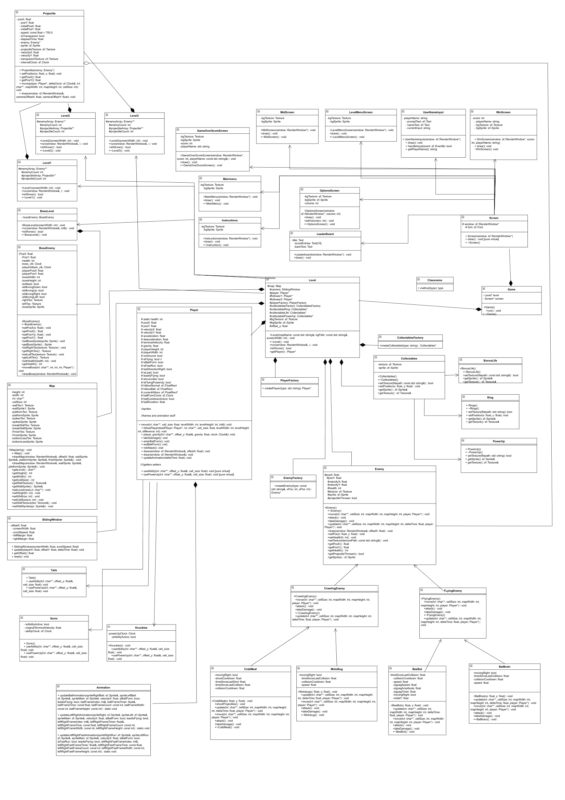

  # 🦔 Sonic Heroes Remake (C++ & SFML)
  
  **A full Object-Oriented Programming (OOP) showcase recreating the team-based mechanics of Sonic Heroes!**

  
  
  
  

---

## About The Project

This project is a 2D remake inspired by *Sonic Heroes*, built entirely from scratch using **C++** and the **SFML (Simple and Fast Multimedia Library)**. 

The primary goal of this project was to implement a fully functional, highly optimized game while strictly adhering to **Object-Oriented Programming (OOP) principles**. It features custom physics, state-driven animations, an automated follower system (true to the Sonic Heroes team mechanic), custom tile-based map parsing, and dynamic camera tracking.

---

## Dynamic Levels & Custom Physics

The game features **4 unique levels**, each manipulating the core physics engine to create distinct gameplay experiences:

1. **Level 1 (Green Hill / Easy):** The standard introductory level featuring normal gravity, friction, and basic enemies.
2. **Level 2 (Ice Cap):** A slippery ice terrain! Friction is drastically reduced here, meaning the player's deceleration is much slower, making precise platforming a true challenge.
3. **Level 3 (Space):** A low-gravity zone. The gravity variable is altered so the player can jump incredibly high and float over massive gaps.
4. **Level 4 (Boss Fight):** A 1v1 showdown where the follower mechanic is disabled (Only Sonic!) against a complex Boss AI that sweeps the screen, tracks your coordinates, and requires 15 hits to defeat.

---

## The "Sliding Window" Camera System

Instead of simply locking the camera to the player's exact X-coordinate (which causes motion sickness and jittering), I engineered a **Sliding Window** algorithm. 

The camera establishes a "dead zone" (`leftMargin` at 25% of the screen, and `rightMargin` at 60%). The camera only begins to pan when the player breaks these margins. Furthermore, the `dynamicScrollSpeed` smoothly adapts to the player's current velocity (capped by their terminal velocity), resulting in a buttery-smooth tracking system that feels exactly like classic Sega platformers.

---

## How to Play

### Menu Navigation
* `P` - Play Game (Starts Level 1)
* `L` - Level Selection (Choose your starting level)
* `I` - View Instructions
* `O` - View Leaderboard
* `R` - Options (Adjust volume)
* `E` or `ESC` - Exit Game
* `B` - Go back to the previous menu

### In-Game Controls & Mechanics

| Action | Key / Input | Description |
| :--- | :--- | :--- |
| **Move Left/Right** | `Left/Right Arrows` | Accelerate and move your team across the level. |
| **Jump** | `Up Arrow` | Standard jump to navigate platforms. |
| **Attack / Ball Form** | `B` | Enter Ball Form to roll under obstacles or attack enemies. |
| **Flight Mode** | `F` | Activate Flight Mode to reach high platforms. |
| **Team Selection** | Z | Switch your lead character! Speed, Flight and Power. |

### Scoring & Hazards
* **Rings:** +1 Point | **Bonus Life: Monitor:** +1 Life | **Enemies:** +100 Points | **Boss:** +1000 Points
* **Spikes:** Damage | **Bottomless Pit:** Instant Death

---

## Architecture & OOP Concepts Used

This game was engineered utilizing heavy Object-Oriented design patterns to cleanly manage over 70+ `.cpp` and `.h` files, as mapped out in the project's UML diagram.

<b>Click to see the core OOP Concepts implemented</b>

### 1. Advanced Polymorphism & Player Handling
Polymorphism is the backbone of the game loop. 
* **The Player System:** Instead of relying on a factory to manage character swapping, the game utilizes base `Player` pointers to dynamically resolve unique character behaviors at runtime (such as checking if the active player can fly, roll, or break walls).
* **The Level System:** The core `Game` loop relies on a purely virtual base class called `Level` containing pure virtual functions like `run()` and `isWinner()`. In `Game.cpp`, the engine simply calls `level->run(window, totalScore)` on a base pointer, and C++ dynamically resolves the physics, enemies, and map rendering for whichever derived level (`Level1`, `Level2`, `Level3`, `BossLevel`) is currently active.
* **Screens:** The same concept applies to the UI. A base `Screen*` pointer dynamically calls `draw()` to render the `MainMenu`, `Instruction`, or `Leaderboard` screen.

### 2. The Factory Design Pattern
To keep entity creation clean and memory-efficient, I utilized the **Factory Pattern** for level population:
* **`EnemyFactory`**: Passes a string ("MotoBug", "BatBrain", "BeeBot") and X/Y coordinates, returning a dynamic `Enemy*` pointer. This keeps the level parser entirely decoupled from the enemy logic.
* **`CollectablesFactory`**: Dynamically generates rings, power-ups, and bonus lives using the same methodology.

### 3. Inheritance & Hierarchy
The project uses strict hierarchical structures to prevent code duplication:
* **Entities:** `CrawlingEnemy`, `CrabMeat`, `MotoBug`, `BeeBot`, and `BossEnemy` all inherit from a core `Enemy` base class, sharing baseline attributes like health, X/Y coordinates, and velocity.
* **Projectiles:** Enemies that shoot inherit functionality from a base `Projectile` class.

### 4. Encapsulation & Data Hiding
All core logic is protected behind strict getters and setters. For example, `Player.cpp` controls its own complex physics (acceleration, deceleration, gravity, and terminal velocity) and handles its own hitbox generation without ever exposing raw variables to the overarching game loop.

### UML Diagram
> 

---

## Custom Map Parsing Engine

Instead of relying on external map editors like Tiled, I built a custom 2D Array parsing engine. Maps are drawn using specific characters in C++ arrays:
* `'w'` = Standard Wall / Floor
* `'r'` = Ring (Score)
* `'b'` = Breakable Wall
* `'s'` = Spikes (Damage)
* `'x'` = Bottomless Pit (Instant Death)
* `'l'` = Bonus Life

This engine checks player hitbox bounds against the grid index of the array, allowing for pixel-perfect collision detection across the 64x64 pixel grid system!

---

## Installation & Setup

Good news—there is **no complex setup or manual library linking required!** The project is pre-configured with all necessary SFML dependencies but you will need to have Visual Studio 2022 pre-installed.

To run this game on your local machine:

**Simply clone the repository**

Navigate to the cloned folder and double-click the included .sln (Solution) file to open the project in Visual Studio 2022.

Press F5 or click Local Windows Debugger at the top of Visual Studio to compile and play the game.
